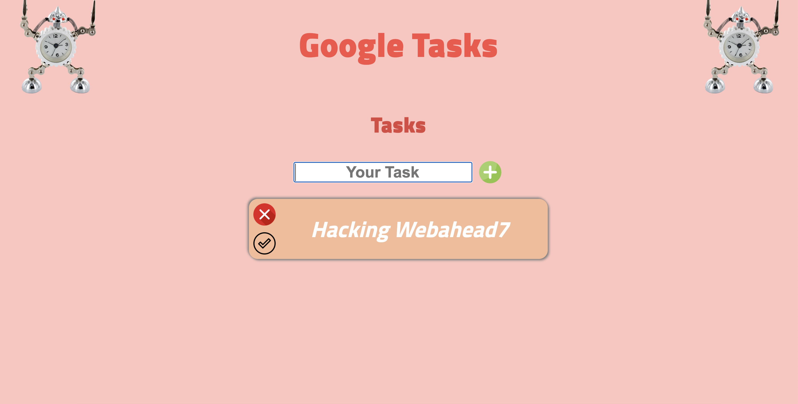

# GoogleTasks

<!-- PROJECT LOGO -->
 

  

  <h3 align="center">Best game EVER</h3>
  

    <a href="https://webahead7.github.io/GoogleTasks/"><strong>Check our website »</strong></a>
  

<!-- TABLE OF CONTENTS -->
## Table of Contents

* [About the Project](#about-the-project)
  * [Built With](#built-with)
* [Getting Started](#getting-started)
* [Roadmap](#roadmap)
* [Contact](#contact)

<!-- ABOUT THE PROJECT -->
## About The Project

  

Google Tasks 

You can manage all your tasks in iur website 

add tasks 
delete tasks 
check if your task is completed or not 
the data is saved locally in your device

## Built With
* HTML
* CSS
* JS

<!-- GETTING STARTED -->
## Getting Started

Check out the project instructions from WebAhead: [Projet instructions](https://github.com/WebAhead/master-reference/blob/master/coursebook/week-4/project.md)

<!-- ROADMAP -->
## Roadmap

See the [open issues](https://github.com/WebAhead7/GoogleTasks/issues) for a list of proposed features (and known issues).

